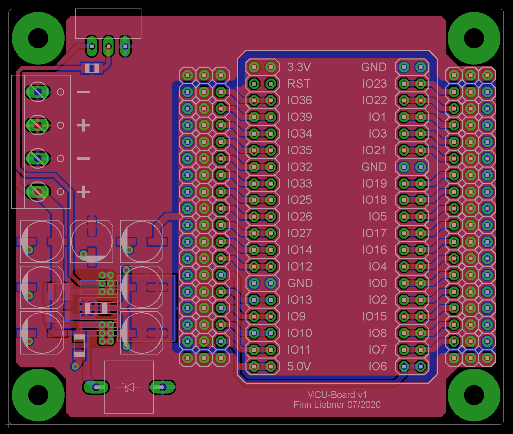

## MCU-Board

Einfaches Breakout-Board für ein ESP32-NodeMCU mit einem 5V-Step-Down-Converter.

## Schaltplan

[Datenblatt LM2678](https://www.ti.com/lit/ds/symlink/lm2678.pdf)

### Bauteile (reichelt)

[1x] RND 1501206B1037
[1x] RND 155HP05 CG
[1x] RND 205-00003
[1x] 15SQ 045 DIO
[1x] SS ESP201
[1x] WUE 7447709220
[1x] LM 2678 S-5.0
[2x] ECC ZA160221MF8
[2x] KEM X7R1206 470N
[2x] MPE 094-2-008
[2x] MPE 094-2-022
[3x] SL 1X40G 2,54
[5x] ECC ZA630220MF8

Kosten ~12€
