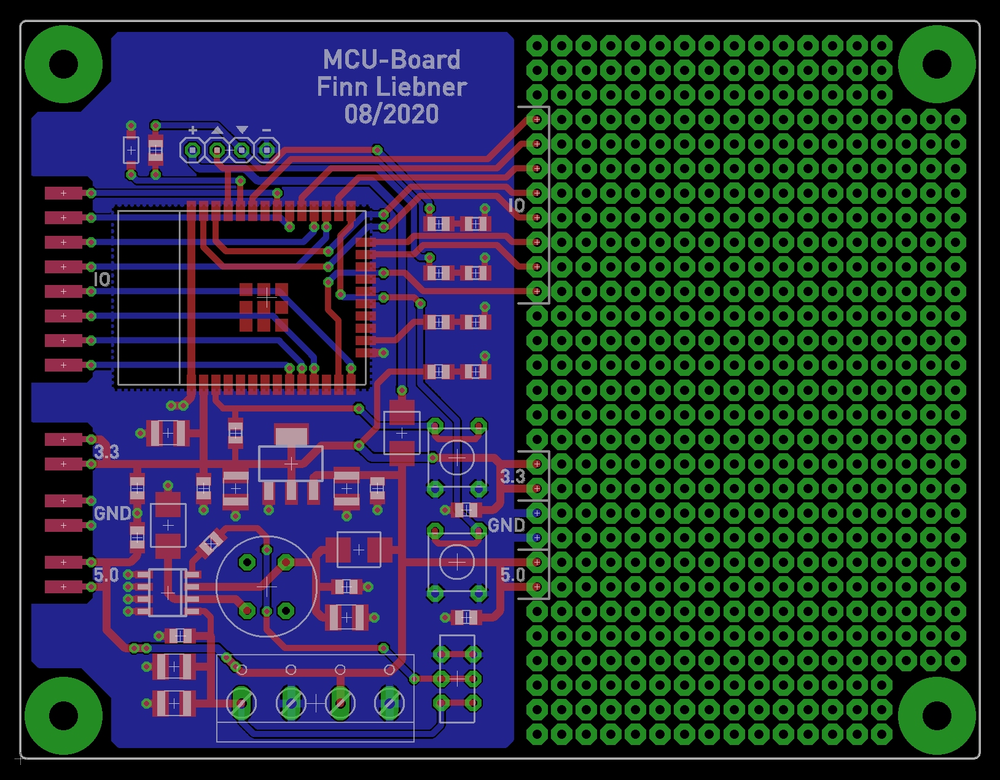

## MCU-Board

### Bauteile

| Stückzahl | Mouser                                                                       |
|-----------|------------------------------------------------------------------------------|
| 1x        | [ESP WROOM 32D](https://www.mouser.de/ProductDetail/356-ESPWROOM3200PS3)     |
| 2x        | [Taster](https://www.mouser.de/ProductDetail/506-FSM4JH)                     |
| 1x        | [Schalter](https://www.mouser.de/ProductDetail/611-JS202011CQN)              |
| 1x        | [LDO 3.3V](https://www.mouser.de/ProductDetail/621-AZ1117IH-3.3TRG1)         |
| 1x        | [Step-Down 5.0V](https://www.mouser.de/ProductDetail/621-AP1509-50SG-13)     |
| 1x        | [Spule 47µH](https://www.mouser.de/ProductDetail/815-AIUR-08-470K)           |
| 3x        | [Schottkydiode](https://www.mouser.de/ProductDetail/750-SS34B-HF)            |
| 1x        | [Zenerdiode 3.3V](https://www.mouser.de/ProductDetail/621-MMSZ5226B-F)       |
| 3x        | [LED Rot](https://www.mouser.de/ProductDetail/720-LHR974-LP-1)               |
| 1x        | [LED Grün](https://www.mouser.de/ProductDetail/720-LGR971-KN-1)              |
| 8x        | [Kondensator 100nF](https://www.mouser.de/ProductDetail/963-UMK212BJ104MG-T) |
| 6x        | [Kondensator 10µF](https://www.mouser.de/ProductDetail/963-UMK325C7106KM-T)  |
| 4x        | [Widerstand 82Ω](https://www.mouser.de/ProductDetail/71-CRCW0805-82-E3)      |
| 2x        | [Widerstand 4.7kΩ](https://www.mouser.de/ProductDetail/71-CRCW0805-4.7K-E3)  |
| 1x        | [Widerstand 36kΩ](https://www.mouser.de/ProductDetail/71-CRCW080536K0FKEA)   |
| 1x        | [Anschlussblock](https://www.mouser.de/ProductDetail/649-220316-H041B01LF)   |
| 1x        | Steckleiste / 2.54 / 4-Pin                                                   |
